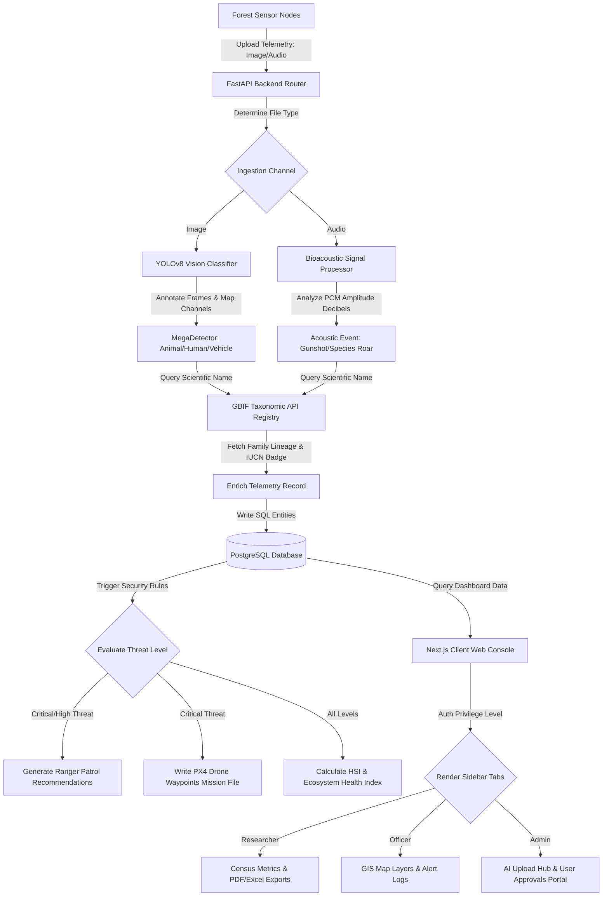

# System Architectural Workflow

This document describes the data flow and architectural pipelines in the **Wildlife Population Intelligence System**.

---

## 🗺️ System Data Flow Diagram

---

## ⚙️ Workflow Explanations

### 1. Telemetry Ingestion
*   **Trigger**: A camera trap or acoustic recorder uploads telemetry media to `/api/v1/observations/upload`.
*   **Operation**: The backend saves the raw file, checks the MIME type, and invokes the inference pipeline.

### 2. Multi-Modal Inference
*   **Vision Channel**: Spawns YOLOv8. The OpenCV DNN model locates bounding boxes, filters using a `0.45` confidence threshold, and splits outputs into *Animal*, *Human*, or *Vehicle* tags.
*   **Audio Channel**: Runs raw PCM amplitude ratio checks. An audio spike exceeding `0.70` (70% volume) triggers a **Critical Gunshot Warning**. Matches vocalization curves against signatures for Tigers, Elephants, and birds.

### 3. Taxonomic & IUCN Resolution
*   **GBIF Registry**: The backend takes the detected animal tag and queries the **Global Biodiversity Information Facility API** to fetch scientific lineage (Phylum, Class, Order, Family, Genus).
*   **IUCN Coding**: Matches the classification to assign conservation status indicators (e.g. `CR` - Critically Endangered, `EN` - Endangered, `LC` - Least Concern).

### 4. Health Indices Calculations
*   **HSI Diagnostics**: Remote sensing canopy indices (NDVI) and distance coordinates compile to calculate the local **Habitat Suitability Index**.
*   **Ecosystem Index**: Computes aggregate metrics using the 5-factor weighted formula: *Biodiversity 30%*, *Population Stability 25%*, *Habitat Quality 20%*, *Endangered Species Status 15%*, and *Environmental Conditions 10%*.

### 5. Automated Protection Triggers
*   **Ranger Patrols**: If the threat assessment is `High` or `Critical`, the recommendation database creates an actionable patrol directive assigned to local ranger units.
*   **Autonomous Drone Flight**: A `Critical` gunshot alert triggers the waypoints script to output a PX4 flight-mission `.waypoints` file mapped directly to the warning sensor coordinates, automating aerial verification.

### 6. Role-Restricted Interface Rendering
*   **JWT Security**: User auth tokens determine permission scope.
*   **Sidebar Navigation**:
    *   `Wildlife Researcher` sees census trend tables, health graphs, and accesses **ReportLab PDF / OpenPyXL Excel** exports.
    *   `Conservation Officer` accesses the **Leaflet map overlays** (Satellite, Terrain, Dark, Light) and dismisses telemetry warning bells.
    *   `Administrator` accesses raw uploads, database re-seeding triggers, and the **User Approvals & Creation Portal**.
